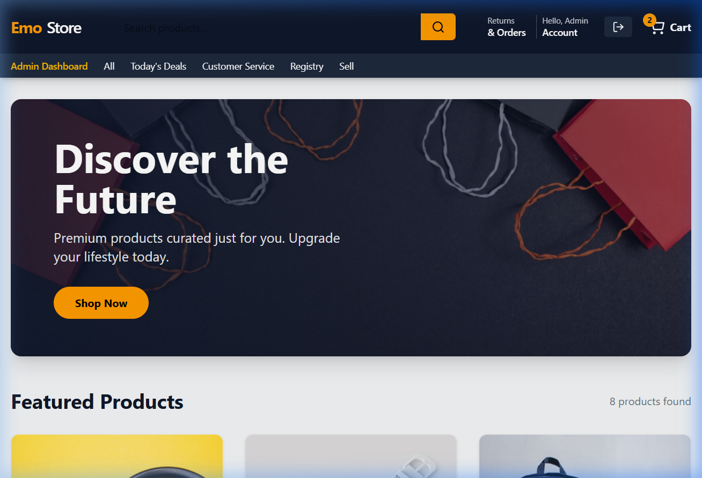

# EmoStore - Premium Full Stack E-commerce Platform



## 🚀 Overview
EmoStore is a professional-grade, high-performance e-commerce platform built with a modern full-stack architecture. It features a robust **Java Spring Boot** backend, a scalable **MySQL** database, and a sleek, responsive **React** frontend. Designed with scalability and professional standards in mind, EmoStore delivers a seamless shopping experience.

---

## ✨ Key Features
-   🔐 **Secure Authentication**: JWT-based login and registration with role-based access control (Admin/Customer).
-   🛒 **Shopping Experience**: Dynamic product catalog, categories, and a persistent shopping cart.
-   💳 **Integrated Payments**: Secure checkout with **Razorpay** integration.
-   📊 **Admin Dashboard**: Comprehensive management of products, inventory, and order statuses.
-   📦 **Order Tracking**: Real-time order placement, history, and status tracking.
-   🎨 **Modern UI**: Built with React and Tailwind CSS for a premium look and feel.
-   🛠️ **REST API**: Well-documented and scalable backend architecture.

---

## 🛠️ Technology Stack

### Backend
- **Framework**: Java 17, Spring Boot 3.x
- **Security**: Spring Security, JWT (JSON Web Tokens)
- **Database**: MySQL (Production-ready)
- **Build Tool**: Maven

### Frontend
- **Framework**: React 18
- **Build Tool**: Vite
- **Styling**: Tailwind CSS
- **State Management**: React Context API
- **Networking**: Axios

---

## 📁 Repository Structure
```bash
├── backend/        # Spring Boot application
├── frontend/       # React + Vite application
├── assets/         # Project screenshots and documentation media
└── README.md       # Project documentation
```

---

## 🚀 Getting Started

### Prerequisites
-   **JDK 17+**
-   **Node.js 18+**
-   **Maven 3.8+**

### Backend Setup
1.  **Navigate to backend**:
    ```bash
    cd backend
    ```
2.  **Configuration**: 
    - Database settings are in `src/main/resources/application.properties`. 
    - By default, it uses a file-based H2 database (no installation needed).
3.  **Run Application**:
    ```bash
    ./mvnw spring-boot:run
    ```
    *The server will start at `http://localhost:8081`.*

### Frontend Setup
1.  **Navigate to frontend**:
    ```bash
    cd frontend
    ```
2.  **Install Dependencies**:
    ```bash
    npm install
    ```
3.  **Run Development Server**:
    ```bash
    npm run dev
    ```
    *Open `http://localhost:5173` to view the app.*

---

## 📑 API Documentation
The backend exposes several endpoints for common e-commerce operations:
- `POST /api/v1/auth/login` - Authenticate users
- `GET /api/v1/products` - List all available products
- `POST /api/v1/orders` - Place a new order
- `GET /api/v1/admin/orders` - Manage order statuses (Admin only)

---

## 👤 Author
Developed as a professional showcase project for a React/Spring Boot portfolio.

## 📄 License
This project is licensed under the MIT License.
