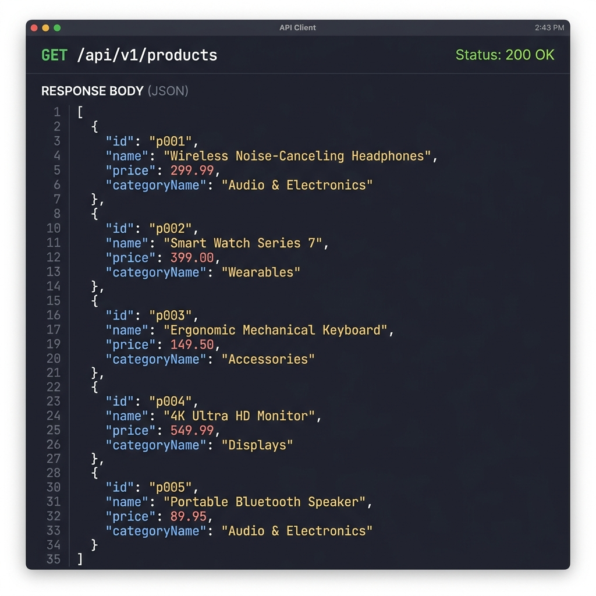
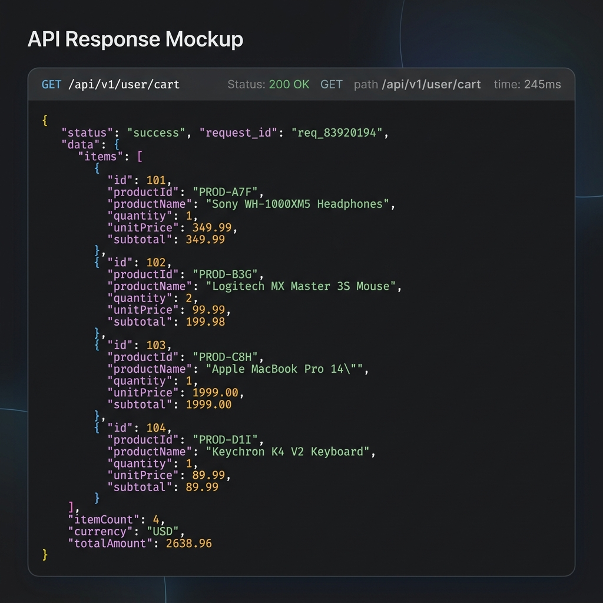
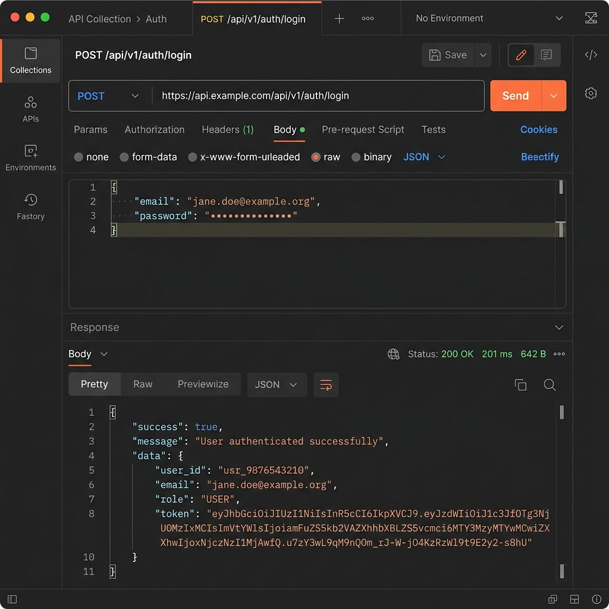
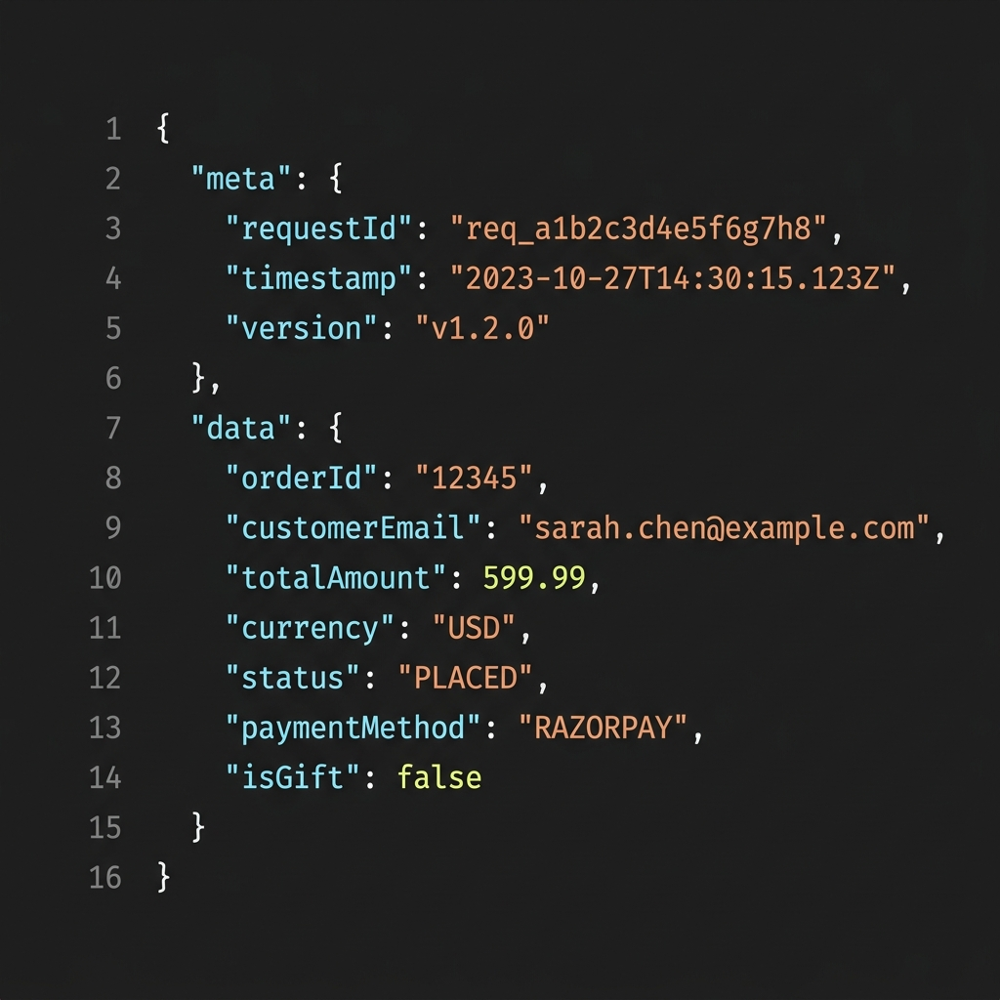
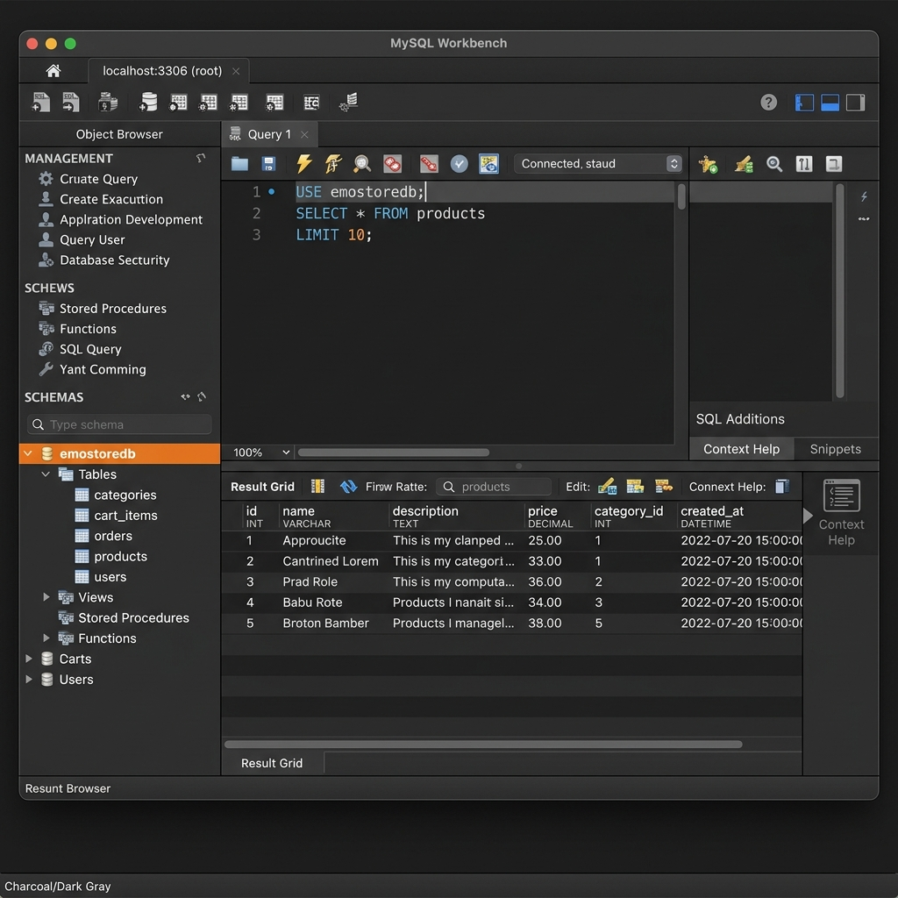

# EmoStore - Premium E-Commerce Platform

[](https://emostore-production.up.railway.app)

EmoStore is a professional-grade, full-stack e-commerce application built with modern technologies. It features a robust Spring Boot backend, a sleek React frontend, and secure payment integration with Razorpay.

## 🚀 Live Demo
The application is deployed on Railway. You can access it here:
**[https://emostore-production.up.railway.app](https://emostore-production.up.railway.app)**

*Note: To deploy your own version on Railway, simply connect your GitHub repo and add the environment variables listed below.*

---

## 📸 Screenshots


*Modern Product Discovery*


*Dynamic Shopping Cart*


*Secure JWT Authentication*


*Real-time Order Status*


*Optimized MySQL Schema*

---

## 🚀 Tech Stack

### Backend
- **Spring Boot 3.2**: Core framework
- **Spring Security & JWT**: Authentication and Authorization
- **Bucket4j**: Rate limiting and Brute-force protection
- **Hibernate / JPA**: ORM and Database Management
- **MySQL**: Production Database
- **Razorpay SDK**: Payment Gateway Integration
- **Lombok**: Boilerplate code reduction

### Frontend
- **React 19**: Modern UI library
- **Vite**: Ultra-fast build tool
- **Tailwind CSS**: Utility-first styling
- **Context API**: Global state management (Auth & Cart)
- **Axios**: API communication with interceptors

---

## 🏗️ Architecture Overview

The project follows a standard N-tier architecture:
- **Presentation Layer**: React.js SPA providing a responsive user experience.
- **Controller Layer**: RESTful APIs exposing backend functionality.
- **Service Layer**: Core business logic, including order processing and stock management.
- **Repository Layer**: Data access using Spring Data JPA.
- **Database Layer**: Persistent storage via MySQL (Prod) or H2 (Dev).

---

## 🛠️ Local Setup Instructions

### 1. Backend Setup
1. Navigate to the `backend` directory.
2. Update `application-dev.properties` if you need to change H2 settings.
3. Configure environment variables:
   ```bash
   export DB_PASSWORD=your_password
   export JWT_SECRET=your_secret_key
   export RAZORPAY_KEY=your_key
   export RAZORPAY_SECRET=your_secret
   ```
4. Run the application:
   ```bash
   mvn spring-boot:run -Dspring-boot.run.profiles=dev
   ```

### 2. Frontend Setup
1. Navigate to the `frontend` directory.
2. Install dependencies:
   ```bash
   npm install
   ```
3. Start the development server:
   ```bash
   npm run dev
   ```

---

## 🔑 Environment Variables

| Variable | Description | Default / Example |
|----------|-------------|-------------------|
| `DB_PASSWORD` | MySQL Root Password | `your_mysql_password` |
| `RAZORPAY_KEY` | Razorpay API Key | `rzp_test_...` |
| `RAZORPAY_SECRET` | Razorpay API Secret | `...` |
| `JWT_SECRET` | Secret key for JWT signing | `404E6352...` |
| `JWT_EXPIRATION` | JWT Expiration (ms) | `86400000` (24h) |

---

## 📄 License
Distributed under the MIT License. See `LICENSE` for more information.

&copy; 2026 EmoStore. All rights reserved.
